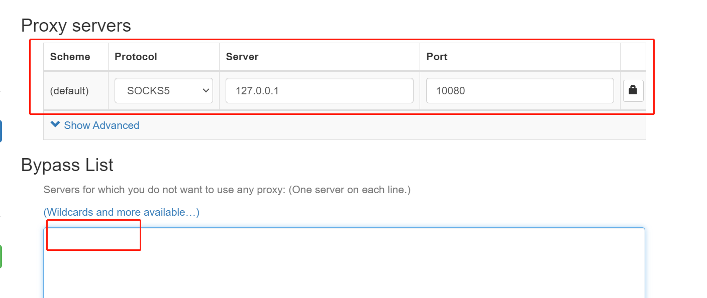

#### SSH动态端口转发

* 缘由

  众所周知的原因，一些苦逼查资料的网站不可达，这只能让人脑瓜越摸越亮

* 已有条件
  博主在某云亚太区某岛国有台云主机，可以自由畅享Internet，IP地址：119.110.JUL.425

* 像岛国的云主机一样畅享互联网--借助SSH动态端口转发
  链路：本地Windows/Mac/Linux ---> 岛国云主机119.110.JUL.425 ---> 畅享互联网
  假设本地到岛国主机连通，SSH连接的key叫119.110.JUL.425.key

* highlight

  > 本地执行如下命令 启动本地监听10080 并SSH连接到远程主机
  >
  > ssh -f -N -D 0.0.0.0:10080 username@119.110.JUL.425 -p 22 -i 119.110.JUL.425.key

* 验证

  > 本地没有图形界面用curl验证 正常返回表示成功
  > curl -x socks5h://localhost:10080 http://www.google.com
  >
  > 浏览器配置socket5代理验证--SwitchyOmega
  >
  > 注意bypass里的127.0.0.1要删除 不然设置的127.0.0.1就没有意义了
  >
  > 

* 小结

  SSH动态端口转发，你学废了吗~